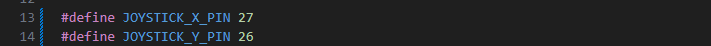
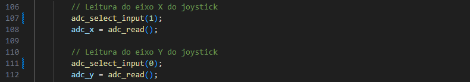
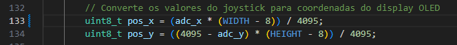

# Projeto: Controle de LEDs e Display com Joystick no RP2040

## 📌 Descrição
Este projeto implementa a leitura de um joystick analógico utilizando o conversor analógico-digital (ADC) do microcontrolador RP2040, integrado à placa **BitDogLab**. O sistema controla a intensidade de LEDs RGB via PWM e exibe a posição do joystick em um display OLED **SSD1306** usando comunicação **I2C**. Além disso, os botões do joystick e um botão extra são utilizados para alternar funcionalidades adicionais.

## 🎥 Demonstração
O vídeo com a execução da simulação pode ser acessado em:
[🔗 Link para o vídeo](https://www.youtube.com/watch?v=Dv59X2cIaaQ&ab_channel=LorenzoBaroni)

## 🔧 🔴 PARA FUNCIONAR NA BITDOGLAB É NECESSARIO FAZER ALGUMAS ALTERAÇÕES NO CODIGO.
O código está funcionando perfeitamente no simulador wokwi e a BitDogLab possui o 'x' e o 'y' do Joystick invertido. Caso queira implementar o codigo na BitDogLab é só fazer essas inversões e deixar da seguinte forma:


- Altere as GPIO'S nas linhas 13 e 14, conforme a imagem:
  .


- Altere os ```adc_select_input();``` nas linhas 107 e 111, conforme a imagem: 


- Altere a variavel ```pos_x``` na linha 133, conforme a imagem: 

- Com isso irá funcionar perfeitamente, caso voce queria implementar em uma BitDogLab. OBS:. Essas imagens tambem estão presentes na pasta BitDogLab do repositório.

## 🎯 Objetivos
✔️ Compreender o funcionamento do **Conversor Analógico-Digital (ADC)** no RP2040.  
✔️ Utilizar **PWM** para controlar a intensidade de LEDs RGB com base nos valores do joystick.  
✔️ Representar a posição do joystick no **display SSD1306** por meio de um quadrado móvel.  
✔️ Aplicar o **protocolo I2C** na comunicação com o display.  
✔️ Implementar **interrupções (IRQ)** e **debouncing** para os botões.  

## 🛠️ Componentes Utilizados
- **Placa BitDogLab (RP2040)**
- **Joystick analógico** (Eixo X e Y analógicos + botão digital)
- **LED RGB** (controlado via PWM)
- **Display OLED SSD1306** (comunicação I2C)
- **Botão extra** para ativar/desativar os LEDs

## 📜 Funcionalidades Implementadas
1️⃣ **Controle dos LEDs RGB:**  
   - O **LED Azul** varia sua intensidade conforme o eixo **Y** do joystick.  
   - O **LED Vermelho** varia sua intensidade conforme o eixo **X** do joystick.  
   - Ambos são controlados via **PWM** para suavizar a transição.  

2️⃣ **Movimentação no Display:**  
   - O display OLED **SSD1306** exibe um **quadrado 8x8 pixels** que se move proporcionalmente à posição do joystick.  

3️⃣ **Botão do Joystick:**  
   - Alterna o estado do **LED Verde**.  
   - Modifica a **borda do display**, alternando entre fina e grossa.  

4️⃣ **Botão A:**  
   - Ativa ou desativa os **LEDs RGB** controlados por PWM.  

## 🔧 Como Compilar e Executar
### 1️⃣ Clonar o repositório
```bash
git clone https://github.com/lorenzobaroni/adc_pwm
```

### 2️⃣ Configurar o ambiente
Certifique-se de que o **Pico SDK** está configurado corretamente e que você tem o **CMake** instalado.

### 3️⃣ Faça a alteração no código.
Modifique o código como está sendo mostrado no inicio do README ou segundo as imagens presentes na pasta BitDogLab.

### 4️⃣ Compilar e Executar
Compile no VS Code e implemente o codigo na sua BitDogLab.

## 📝 Licença
Este programa foi desenvolvido como um exemplo educacional e pode ser usado livremente para fins de estudo e aprendizado.

## 📌 Autor
LORENZO GIUSEPPE OLIVEIRA BARONI
